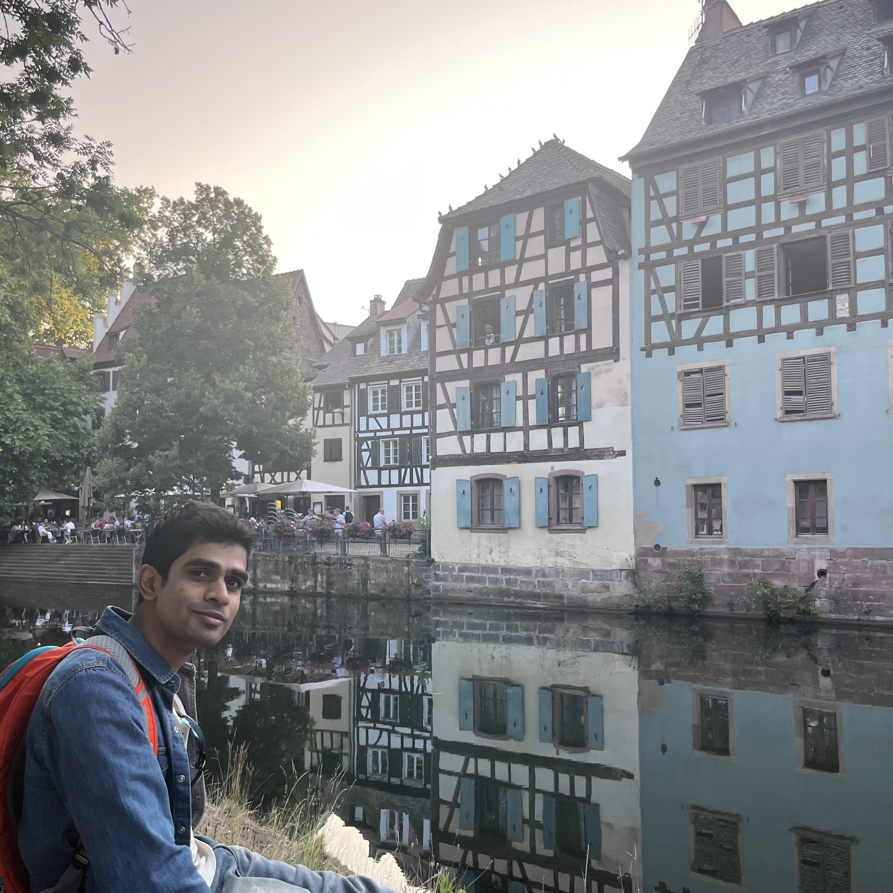

  

### Who am I?
I am currently a fourth year computational biology PhD student at Universität Bielefeld working at the intersection of deep learning and genomics. I was funded by a Marie Skłodowska-Curie fellowship as part of the [ALPACA](https://alpaca-itn.eu/) project. I am advised by Prof. Dr. Alexander Schönhuth in the Genome Data Science Group. I have a background in electrical engineering, obtained from VTU, Karnataka, India and a masters degree in biomedical engineering from the [Indian Institute of Technology Madras](https://www.iitm.ac.in). I subsequently worked in the data science/ML industry for four years on a bunch of stuff, prior to starting my PhD. I also had short stints as a volunteer grade school maths teacher and as a science writer. I also ran DataKind Bengaluru, the Bengaluru chapter of [DataKind](https://www.datakind.org/) for a couple of years in a volunteer capacity. I hail from the city of Bengaluru, located in the south of India.

### Research Interests
I am broadly interested in the intersection of AI and ML with biology. My current interests are:

* Generative modeling applied to genomics  
* Computationally deciphering antibiotic resistance  
* Interpretability and privacy in healthcare  
  

### Miscellaneous
Outside of research, I like to [read](https://www.goodreads.com/user/show/13626649-raghuram-d-r), go on long runs (my PB is 10KM in 42 minutes), hike, and indulge in the occassional bird-watching (my favourite birds are the red-whiskered bulbul and the European green woodpecker). Until a couple of years back, I was an active trivia/pub quizzer.

I am not a medical doctor! D R are my initials. D is a [toponym](https://en.wikipedia.org/wiki/Toponymic_surname), and R is my father's name [patronym](https://en.wikipedia.org/wiki/Patronymic). This naming convention is common in the south of India, where I hail from. My name in the Kannada script is ರಘುರಾಮ್ ದಂಡಿನಶಿವರ.

### Find me on
* email raghuram(at)CeBiTec(dot)Uni(hyphen)Bielefeld(dot)DE
* X, formerly known as Twitter [pseudodoctor](https://www.twitter.com/pseudodoctor)

